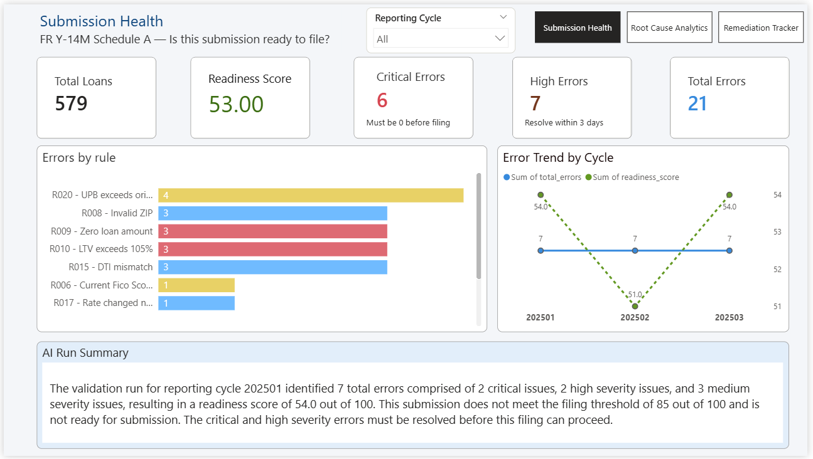
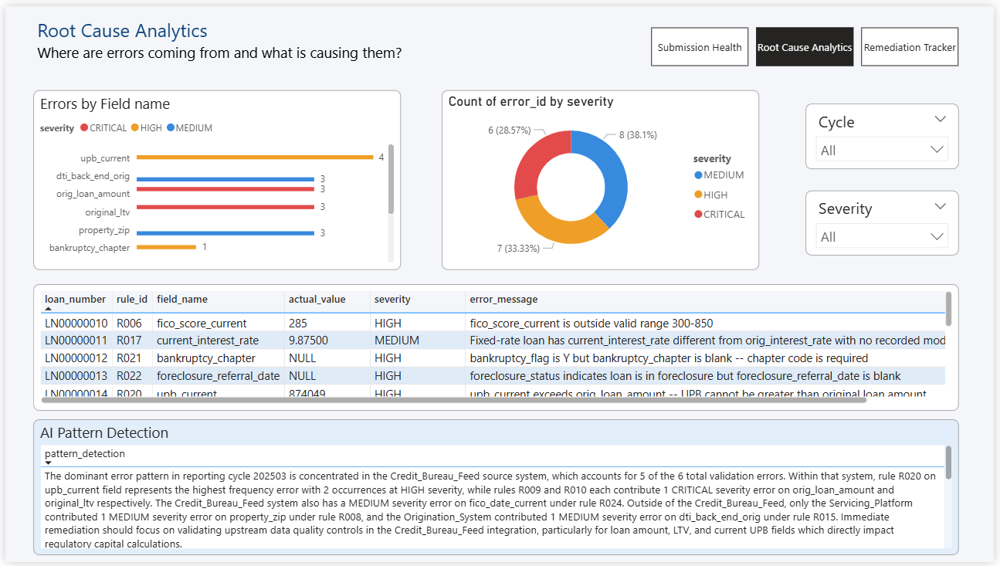
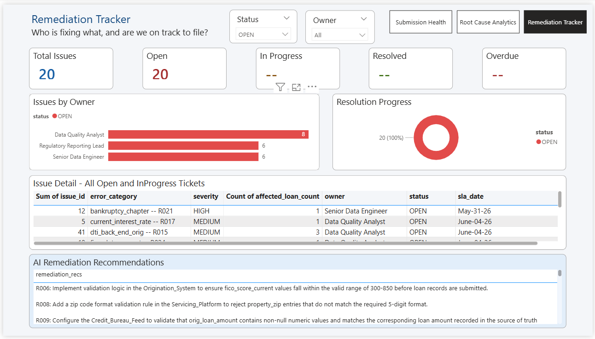

# Y-14M Sentinel
### AI-Assisted Regulatory Data Observability Platform for FR Y-14M Schedule A
> Automates pre-submission validation, issue tracking, AI analysis, and reporting for Federal Reserve FR Y-14M First Lien Mortgage data — replacing manual spreadsheet-based quality checks with a structured, audit-ready pipeline.

---
## Architecture
```
┌─────────────────────────────────────────────────────────────┐
│                    SOURCE LOAN DATA                         │
│         (schedule_a_loans_orig + monthly tables)            │
└──────────────────────────┬──────────────────────────────────┘
                           │
                           ▼
┌─────────────────────────────────────────────────────────────┐
│                 VALIDATION ENGINE                           │
│   Python + validation_rules.json (23 rules, 3 severities)   │
│   Checks: FICO · LTV · DTI · ZIP · State · Dates · Flags    │
└──────────────────────────┬──────────────────────────────────┘
                           │
              ┌────────────┴────────────┐
              │                         │
              ▼                         ▼
┌─────────────────────┐    ┌───────────────────────────┐
│  validation_errors  │    │    validation_runs        │
│  (immutable log)    │    │(readiness score + counts) │
└─────────────────────┘    └───────────────────────────┘
              │
              ▼
┌─────────────────────────────────────────────────────────────┐
│                   ISSUE TRACKER                             │
│  Auto-creates tickets · SLA dates · Owner by severity       │
└──────────────────────────┬──────────────────────────────────┘
                           │
                           ▼
┌─────────────────────────────────────────────────────────────┐
│              CLAUDE AI ANALYSIS (Parallel)                  │
│   Pattern Detection  ·  Run Summary  ·  Fix Recommendations │
│   3 prompts fired simultaneously · ~5 second turnaround     │
└──────────────────────────┬──────────────────────────────────┘
                           │
                           ▼
┌─────────────────────────────────────────────────────────────┐
│                  POWER BI DASHBOARD                         │
│       Submission Health · Root Cause Analytics .            |
|                  Remediation Tracker                        │
└─────────────────────────────────────────────────────────────┘
```

---

## Screenshots

### Page 1 — Submission Health

*Readiness score, error counts by severity, error trend across 3 cycles, and AI plain-English run summary*

### Page 2 — Root Cause Analytics

*Errors by field name, errors by source system, severity split, and full error detail table*

### Page 3 — Remediation Tracker

*Issue status by owner, SLA compliance, overdue highlighting, and AI fix recommendations*

---

## What it does

| Step | Script | What happens |
|---|---|---|
| 1 — Validate | `validate_final.py` | Runs 23 FR Y-14M rules. Writes errors to `validation_errors`. Computes readiness score. |
| 2 — Track | `issue_tracker_final.py` | Auto-creates remediation tickets per error cluster with SLA dates and owner by severity. |
| 3 — Analyse | `ai_analysis_final.py` | Fires 3 Claude API prompts in parallel — pattern detection, run summary, fix recommendations. |
| 4 — Report | Power BI | 3-page dashboard with readiness score, error trends, and SLA compliance. Connects live to PostgreSQL. |

---

## Key numbers

- **23** validation rules covering origination and monthly loan data
- **3** AI prompts fired in parallel per run (~5 second total turnaround)
- **6** PostgreSQL tables, 3NF schema with FK constraints, check constraints, and audit triggers
- **3** reporting cycles supported with portfolio growth simulation
- **0** manual steps between validation run and dashboard update — fully automated

---

## Tech stack

| Layer | Technology |
|---|---|
| Pipeline | Python 3.10+ |
| Database | PostgreSQL 16 |
| DB driver | psycopg2-binary (single-connection pattern, execute_values bulk inserts) |
| AI layer | Anthropic Claude API (claude-haiku model, ThreadPoolExecutor for parallel calls) |
| Reporting | Power BI Desktop — direct PostgreSQL connection |
| Config | JSON rules file — rules are config not code |
| Environment | python-dotenv — credentials never hardcoded |

---

## Project structure

```
y14m-sentinel/
├── scripts/
│   ├── validate_final.py          # 23 validation rules
│   ├── issue_tracker_final.py     # auto-create remediation tickets
│   ├── ai_analysis_final.py       # Claude API — 3 parallel prompts
│   └── seed_data_final.py         # test data — 3-cycle portfolio growth
├── config/
│   └── validation_rules.json      # rule definitions (ID, severity, message)
├── sql/
│   ├── create_schema.sql          # schema, FK constraints, check constraints, triggers
│   └── alter_tables.sql           # schema evolution — removes redundant columns, adds audit cols
├── docs/
│   └── screenshots/               # Power BI dashboard images
├── .env.example                   # copy to .env, fill in credentials
├── requirements.txt
└── README.md
```

---

## Database schema

6 tables in `y14m_sentinel` schema. Designed around the principle that validation logs are immutable and remediation workflows are separate.

```
schedule_a_loans_orig          → static origination record (1 row per loan)
schedule_a_loans_monthly       → monthly snapshot (1 row per loan per cycle)
        │
        ├── validation_runs    → 1 per pipeline execution, stores readiness score
        │        │
        │        └── validation_errors  → immutable error log, 1 row per error found
        │                 │
        │                 └── issue_tracker  → mutable remediation workflow
        │
        └── ai_analysis_results → Claude output per run
```

---

## Quick start

**1. Install dependencies**
```bash
git clone https://github.com/rasikadatalkar/y14m-sentinel.git
cd y14m-sentinel
pip install -r requirements.txt
```

**2. Configure environment**
```bash
cp .env.example .env
# Edit .env — add DB_PASSWORD and ANTHROPIC_API_KEY
```

**3. Create schema**
```bash
psql -U postgres -f sql/create_schema.sql
```

**4. Seed test data and run pipeline**
```bash
python scripts/seed_data_final.py
# Script pauses 3 times — run validate_final.py in a second terminal each time

python scripts/validate_final.py        # enter: 202501,202502,202503
python scripts/issue_tracker_final.py
python scripts/ai_analysis_final.py
# Open Power BI and refresh
```

---

## Validation rules

23 rules across origination (`schedule_a_loans_orig`) and monthly (`schedule_a_loans_monthly`) data.

| Rule | Severity | What it checks |
|---|---|---|
| R003 | HIGH | 10 required origination fields — NULL in any fails |
| R004 | HIGH | Origination date must be a real past date |
| R005 | CRITICAL | FICO 300-850 or Fed codes 9997/9998/9999 — rejects 0 and 999 |
| R006 | MEDIUM | Monthly refreshed FICO must also be in valid range |
| R007 | HIGH | Property state must be a valid US state code |
| R008 | MEDIUM | ZIP must be exactly 5 numeric digits |
| R009 | MEDIUM | Loan amount must be greater than zero |
| R010 | CRITICAL | LTV must be 0.01 to 1.05 maximum |
| R011 | HIGH | Lien position must be 1 — Schedule A is first lien only |
| R012 | CRITICAL | Reported LTV must match computed (amount ÷ value) within 1% |
| R013 | HIGH | First payment must be 15-75 days after origination |
| R014 | HIGH | CLTV cannot be less than LTV — mathematically impossible |
| R015 | MEDIUM | Back-end DTI must be >= front-end DTI |
| R016 | HIGH | ARM products require variable rate type |
| R017 | MEDIUM | Fixed rate loans cannot change rate without a modification |
| R018 | HIGH | IO flag Y requires a term — flag and term must agree |
| R019 | HIGH | Balloon flag Y requires a term |
| R020 | MEDIUM | Current UPB cannot exceed original loan amount |
| R021 | HIGH | Bankruptcy flag Y requires chapter code |
| R022 | HIGH | Active foreclosure must have a referral date |
| R023 | HIGH | Modification recorded but loss mitigation status is 0 |
| R024 | MEDIUM | FICO date must be within 90 days of reporting cycle |
| R025 | MEDIUM | Reporting month must be valid YYYYMM format |

Readiness score formula: `100 - (CRITICAL × 15) - (HIGH × 5) - (MEDIUM × 2)`

---

## Dashboard pages

**Page 1 — Submission Health**
Readiness score, critical/high/total error counts, errors by rule (bar chart), error trend across cycles (line chart), AI plain-English run summary.

**Page 2 — Root Cause Analytics**
Errors by field name, errors by source system (stacked bar), severity split (donut), full error detail table with conditional formatting, AI pattern detection.

**Page 3 — Remediation Tracker**
Issue counts by status, issues by owner, resolution progress (donut), full issue detail table with SLA dates and overdue highlighting, AI fix recommendations.

---

## Regulatory context

FR Y-14M is a Federal Reserve data collection requiring bank holding 
companies to submit detailed loan-level mortgage data monthly. 
Schedule A covers First Lien Residential Mortgages.

> **Disclaimer:** This project is a technical demonstration built for 
> portfolio and learning purposes. It is not affiliated with or endorsed 
> by the Federal Reserve Board.
---

## Future roadmap — Phase 2

This is Phase 1. The foundation is intentionally built to extend into 
a broader intelligent data observability platform.

Areas being explored for Phase 2:
- Cloud data warehouse integration
- AI-assisted natural language data investigation  
- Metadata-driven validation framework
- Real-time monitoring capabilities

More details as it develops.
---

## Requirements

```
psycopg2-binary>=2.9.0
anthropic>=0.25.0
python-dotenv>=1.0.0
```

PostgreSQL 15+ · Python 3.10+ · Power BI Desktop (free) · Anthropic API key
